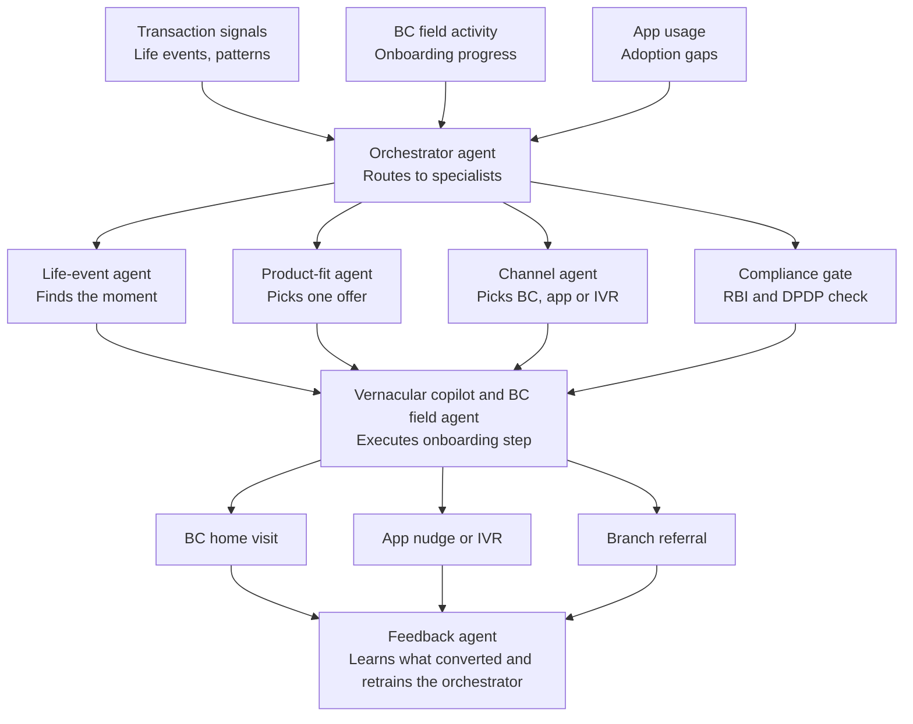

# Setu

**Sanskrit for "bridge."**

An agentic AI mesh that turns SBI's Business Correspondent network into an AI-augmented customer acquisition channel, reaching the customers the app alone cannot.

Built for the SBI Hackathon at GFF 2026, Customer Acquisition Track.

## The problem

Most acquisition ideas assume a customer will discover and self-serve through an app. For SBI's next wave of customers, that assumption breaks:

- **Reach:** SBI's branch network and tens of thousands of Business Correspondents already sit closer to the next customer than any app screen does.
- **Trust, not literacy:** In semi-urban and rural India, the barrier is rarely the interface. It is trust in a screen versus trust in a known local person.
- **The hidden leak:** Manual KYC, inconsistent BC scripts, and silent onboarding drop-offs quietly cost more acquisitions than any app redesign will win back.

## The insight

SBI's app can't reach the next 200 million customers. Its people already can.

Setu focuses on the human-assisted channel, where trust, not interface design, decides whether a customer gets acquired at all. Acquisition, adoption, and engagement stop being three separate efforts and become one continuous, learning pipeline.

## What Setu is

A multi-agent AI system, not a single chatbot. Nine specialised agents share one pipeline: sensing who is ready to be banked, deciding what and how to offer, and equipping a human correspondent to close the loop.

| Stage | Agent | Job |
|---|---|---|
| Sense | Life-event agent | Detects a signal that someone is ready to be acquired |
| Decide | Product-fit agent | Picks one relevant product, not a broadcast of five |
| Decide | Channel-segmentation agent | Picks BC visit, app/IVR nudge, or branch referral |
| Gate | Compliance and consent agent | Checks every action against RBI and DPDP rules before it fires |
| Act | Vernacular conversation agent | Dialect-aware voice guidance for BC and IVR interactions |
| Act | BC field copilot agent | Live script, document checks, CBS auto-fill for the correspondent |
| Recover | Drop-off recovery agent | Detects a stalled onboarding and schedules human follow-up |
| Learn | Feedback and learning agent | Learns what converted and retrains the upstream agents |
| Coordinate | Orchestrator agent | Owns state and routes tasks between every other agent |

## Process flow



## Tech stack

- **Backend:** Python 3.11+, FastAPI
- **Agents:** plain Python classes, one file per agent, kept framework-light so the architecture stays visible in code
- **LLM reasoning:** Anthropic API (vernacular and reasoning agents)
- **Compliance rules engine:** deterministic Python rules, not an LLM, so decisions stay auditable
- **Data:** local JSON/SQLite for the prototype (no real core banking system integration; CBS is mocked)
- **Dashboard:** minimal, added in week 4, to visibly show the compliance agent evaluating and blocking a non-compliant action live

> This stack is a starting assumption for a fast prototype. If you'd rather build in Node/TypeScript, update this section and the agent stubs accordingly before continuing.

## Project structure

```
setu-prototype/
├── .github/
│   └── copilot-instructions.md   # Full mission context for GitHub Copilot
├── agents/
│   ├── orchestrator.py
│   ├── life_event_agent.py
│   ├── product_fit_agent.py
│   ├── channel_agent.py
│   ├── compliance_agent.py
│   ├── vernacular_copilot.py
│   ├── bc_field_agent.py
│   ├── dropoff_recovery_agent.py
│   └── feedback_agent.py
├── data/
│   └── sample_signals.json       # Mock transaction/BC/app signals for local testing
├── main.py                       # FastAPI entrypoint, wires agents together
├── requirements.txt
├── .env.example
└── .gitignore
```

## Getting started

1. Clone or open this folder in VS Code.
2. Create a virtual environment and install dependencies:
   ```bash
   python -m venv venv
   source venv/bin/activate        # Windows: venv\Scripts\activate
   pip install -r requirements.txt
   ```
3. Copy `.env.example` to `.env` and fill in your Anthropic API key:
   ```bash
   cp .env.example .env
   ```
4. Run the API locally:
   ```bash
   uvicorn main:app --reload
   ```
5. Open `.github/copilot-instructions.md` once at the start of your session so GitHub Copilot (Chat or inline) has the full mission and architecture in context before you ask it to build out each agent.

## 30-day prototype plan

Scoped to what a small team can demo credibly by the jury round.

| Week | Focus | Goal |
|---|---|---|
| 1 | Orchestrator and compliance agent | Stand up the backbone: a signal comes in, gets routed, and passes through the compliance gate |
| 2 | One live vertical | Wire life-event and product-fit agents to a single onboarding flow (example: a savings-account trigger) |
| 3 | Vernacular BC copilot | Voice-guided onboarding conversation in Hindi, with document verification and form auto-fill |
| 4 | Dashboard and demo polish | Live dashboard showing the compliance agent evaluating and blocking a non-compliant action in real time |

Aligned to the hackathon timeline: shortlisting July 15, jury presentation August 20, finalists August 25.

## Regulatory readiness

Compliance is a first-class agent in the architecture, not a checklist added at the end. Every autonomous action passes through it before it reaches a customer.

- **RBI alignment:** every outbound contact is checked against RBI rules on customer outreach and fair practice before it fires.
- **DPDP Act consent:** no signal is used and no action is taken without a valid, current consent artifact tied to that customer.
- **Auditability:** every decision the mesh makes is logged, so SBI can review why a given customer received a given offer through a given channel.

## Status

Early prototype scaffold. Agent files are stubs with clear responsibilities and TODOs, ready for Copilot-assisted implementation following the week-by-week plan above.
